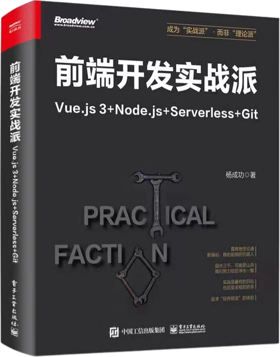
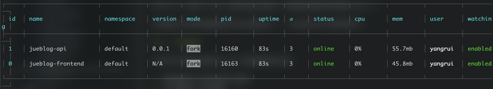

# jueblog-combat

“仿稀土倔金”博客系统，新书《前端开发实战派》的项目实战源码。

- 前端技术栈：`Vue3 + Pinia + TypeScript`
- 后端技术栈：`Express + MongoDB + Serverless`

快速掌握 JavaScript 全栈开发能力，成为独立开发者。

## 能学到什么

能学到的前端知识包括：

- Vue3 组合式 API 综合应用。
- Element Plus 框架的使用。
- Axios 全局请求、登录验证、响应拦截、错误处理等。
- Pinia 全局状态管理应用。
- Vue Router 的页面路由设计。
- Marndown 编辑器开发。
- TypeScript 的深度集成。

能学到的后端知识包括：

- Node.js 服务端基础。
- Express 搭建 API 基础。
- 路由、请求、响应、中间件等。
- 数据库 MongoDB 的增查改删以及高级查询。
- 基于 mongoose 的数据库文档设计以及验证。
- 基于 jwt 的接口权限验证。
- 用户相关的登录验证、加密验证。
- 全局错误处理，状态码响应。

## 购买纸质书

开发本项目需要的技术基础+实战详细介绍全在这本书里，如有需要请点击购买；欢迎加作者微信咨询。

<div>
  <a target="_blank" href="https://item.jd.com/14337084.html"></a> &nbsp;&nbsp;&nbsp;&nbsp;
  
</div>

## 启动项目

将项目下载到本地，然后按照以下步骤运行。

（1）全局安装 `pm2`

```sh
$ yarn global add pm2
```

**pm2** 是流行的 Node.js 进程管理器，安装后使用 `pm2` 命令管理项目。

（2）安装项目依赖

```sh
$ yarn
```

（3）启动项目

```sh
$ yarn run server
```

此命令执行后，项目前端与后端会同时启动，并支持修改自动更新。可以用 `pm2 ls` 命令查看启动结果：



如果想查看日志，使用 `pm2 logs <id>` 命令。如：

```sh
$ pm2 logs 1

1|jueblog- | API 启动，监听 9000 端口
1|jueblog- | API 启动，监听 9000 端口
...
```

## 配置数据库和请求地址

在 server 目录下找到 `config.example.json` 文件，修改文件中的三个属性：

- `mongo_url`：MongoDB 连接地址。
- `mongo_username`：MongoDB 用户名。
- `mongo_password`：MongoDB 密码。

修改后将文件重命名为 `config.json`，配置即可生效。

没有这一步操作，项目启动无法连接数据库。

前端请求的 API 接口根 URL，需要通过环境变量来配置。在根目录下的找到 `.env.local.example` 文件，这里定义了开发环境下的 API 地址：

```
VITE_API_BASEURL=http://localhost:9000
```

同样将该文件重命名为 `.env.local`，配置即可生效。

当 API 部署到线上后，需要将这里的 `http://localhost:9000` 更换为线上地址。
